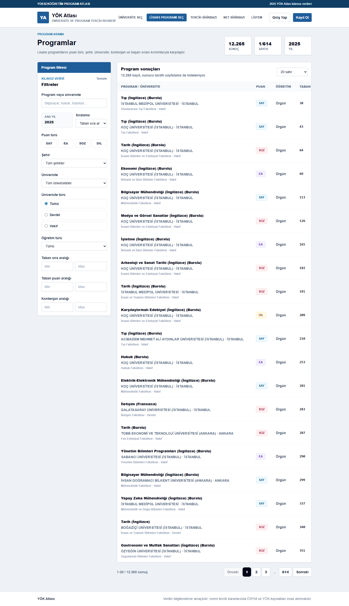

# CampusData

CampusData is a full-stack university preference platform for students in Turkey. It brings YOK Atlas undergraduate data into a searchable, filterable product where candidates can compare universities, inspect program history, build preference lists, and find realistic options by ranking band.

[](https://github.com/ykart897/CampusData/actions/workflows/ci.yml)



## Why This Project Matters

Choosing a university in Turkey depends on scattered program metadata, yearly quota changes, base rankings, score type, city, scholarship status, and personal preference order. CampusData turns that into a product workflow:

- Browse 12,000+ undergraduate programs imported from a validated YOK Atlas snapshot.
- Filter by university, city, score type, program name, ranking, and quota data.
- Review yearly placement history before adding a program to a preference list.
- Build and reorder a private preference list with authenticated accounts.
- Use a preference wizard that separates certain, risky, and difficult choices around the student's ranking.

## Product Highlights

- Real YOK Atlas snapshot import with validation, backup, and safe upsert behavior.
- JWT authentication with token revocation for password changes and deactivated users.
- User-scoped preference lists with reorder validation and concurrency-safe updates.
- Responsive React UI verified with desktop and mobile Playwright flows.
- CI pipeline for backend tests, frontend build, and OSV dependency scanning.
- Docker Compose setup for PostgreSQL and Redis.

## Tech Stack

| Area | Technologies |
| --- | --- |
| Frontend | React 18, TypeScript, Vite, Tailwind CSS |
| Data/UI | TanStack Query, TanStack Table, Recharts, Axios |
| Backend | Java 17, Spring Boot 3.5, Spring Security, Spring Data JPA |
| Database | PostgreSQL, Flyway |
| Cache | Redis, Caffeine |
| Auth | JWT, BCrypt |
| Quality | Maven tests, Playwright E2E, OSV Scanner, GitHub Actions |
| Runtime | Docker, Docker Compose, nginx |

## Architecture

```text
frontend/                 React application and Playwright tests
backend/                  Spring Boot API, auth, services, migrations
database/                 YOK Atlas snapshot/import tooling
docs/                     Setup guide, data-quality reports and screenshots
docker-compose.yml        Local PostgreSQL and Redis services
```

## Quick Start

Use Java 17, Maven, Node.js 22.12+ and Docker Compose. Follow the [local development guide](docs/SETUP.md) to start the services, load the included demo dataset and run the application.

The frontend runs at `http://localhost:5173`, the API at `http://localhost:8080`, and API documentation at `http://localhost:8080/swagger-ui/index.html`.

## Verification

Useful checks before a release:

```powershell
cd backend
mvn test
```

```powershell
cd frontend
npm audit
npm run build
npm run test:e2e
```

Browser tests require both local servers, imported demo data and Microsoft Edge. GitHub Actions runs backend tests, the frontend build and OSV dependency scanning; browser tests are currently run locally.

## Data Import Safety

The importer supports three modes:

- `snapshot`: fetches YOK Atlas data into `database/snapshots/` without changing the database.
- `plan`: validates and prepares the upsert without changing the database.
- `import`: requires `YOKATLAS_IMPORT_APPROVED=true`, creates a database backup, validates the snapshot, and upserts university/program/yearly data without deleting users or preference lists.

After import, it checks counts, orphan programs, orphan yearly rows, blank names, and programs without yearly data.

## Documentation

- [Local development and troubleshooting](docs/SETUP.md)
- [Data tooling and snapshot policy](database/README.md)
- [Map data workflow](docs/MAP_DATA_PIPELINE.md)
- [Data coverage report](docs/VERI_KALITE_RAPORU.md) (dated analysis)
- [Scholarship variant review](docs/VAKIF_PROGRAM_VARYANT_KONTROLU.md) (dated analysis)

## Yusuf's Verified Contribution

The public Git history attributes the current hardening and portfolio-readiness pass to [Yusuf Kart](https://github.com/ykart897). The traceable work includes:

- Strengthening authentication with token-version revocation, disabled-user checks, explicit unauthorized responses, and configurable CORS origins.
- Making preference-list updates safer with ownership checks, reorder validation, and a pessimistic write lock for concurrent changes.
- Reworking the preference wizard around validated ranking bands and removing an unverified score-estimation model instead of presenting speculative results.
- Adding JUnit coverage for JWT, bachelor-program, and preference-list behavior, plus Playwright authentication and responsive visual flows.
- Establishing backend/frontend/security CI checks and tightening the guarded YÖK Atlas import workflow.

These claims are limited to changes visible in [the repository history](https://github.com/ykart897/CampusData/commits/main/?author=ykart897); they do not imply sole authorship of the original collaborative project.

## Two-minute demo path

1. Filter the program catalog by city, score type, and ranking range.
2. Open a program to compare its yearly quota and placement history.
3. Sign in, add programs to a preference list, and reorder them.
4. Enter a ranking in the preference wizard and compare certain, risky, and difficult groups.
5. Resize to a mobile viewport and repeat the catalog-to-preference flow.

## Contributors

CampusData was developed collaboratively by [Yusuf](https://github.com/ykart897) and [Enes Canbulat](https://github.com/EnesCanbulat). This repository maintains Yusuf's continued work on the shared project; the original collaboration is preserved in Git history.

## Project Status

CampusData is ready for portfolio review and local product demos. Public production deployment is intentionally left as a separate release step so environment secrets, domain, monitoring, and deployment ownership can be handled deliberately.
